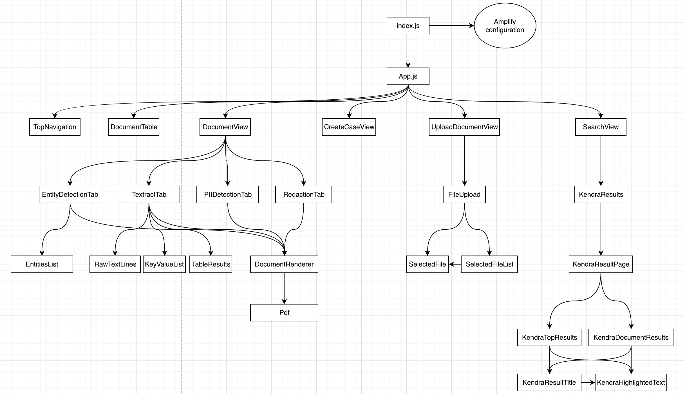

## Enhanced Document Understanding on AWS - WebApp

This project is the web interface (UI Application) that provides the front-end experience. The application is
based on [Reactjs](https://react.dev/) framework and uses components from the [AWS Cloudscape Design System](https://cloudscape.design/)

### UI Components



### Local Configuration Setup

To build and run the application locally, the setup requires

-   [Nodejs 18.x](https://nodejs.org/en) or higher installed

Follow the below steps before building the web app for local execution

-   The backend infrastructure stacks from `source/infrastructure` are deployed in your AWS account
-   Create a file `source/ui/public/runtimeConfig.json` (if one does not exist) by executing

```
mkdir -p source/ui/public
touch source/ui/public/runtimeConfig.js
```

-   From the AWS CloudFormation console, navigate to the `Outputs` tab of the main/ parent stack deployed and copy the `Value` of the `Key` named `WebConfigKey`.
-   Navigate to AWS Systems Manager Parameter Store in the AWS web console, search for the `Key` in the previous step and copy the contents into the file created in the previous (step #2) steps (`source/ui/public/runtimeConfig.json`)

For reference, the string in the Parameter Store should look something like the below:

```
    {
        "ApiEndpoint": "https://<endpoint>.execute-api.us-east-1.amazonaws.com/prod/",
        "UserPoolId": "<user-pool-id>",
        "UserPoolClientId": "<user-pool-client-id>",
        "KendraStackDeployed": "<Yes/No>",
        "AwsRegion": "<the region where the stack was deployed>",
        "NumRequiredDocuments": "<Number of documents required for the workflow>,
        "UniqueDocumentTypes": ["doc-type-1", "doc-type-2", "etc..."],
        "WorkflowConfigName": "<name of the workflow config>"
    }
```

After completing the above steps, you can run the web application locally.

### Build and Run the App Locally

1. From the project root directory, change directory to `source/ui`

```
    cd source/ui
```

2. Install the library modules if building the project for the first time

```
    npm install
```

3. Building the project with the below command will generate a `build` folder which contains
   the compiled components and minified javascript files.

```
    npm run build
```

4. Executing the following command will run a local server on port 3000 (http://localhost:3000)

```
    npm start
```

You should now be able to log in with the User Id and Password for which you should have received an email during deployment. You can also
create additional users in the Amazon Cognito User Pool from the AWS web console.
